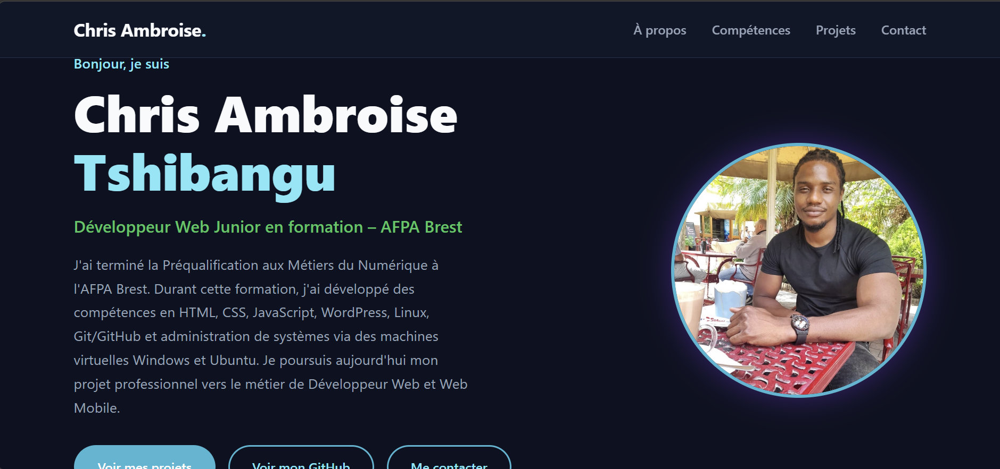
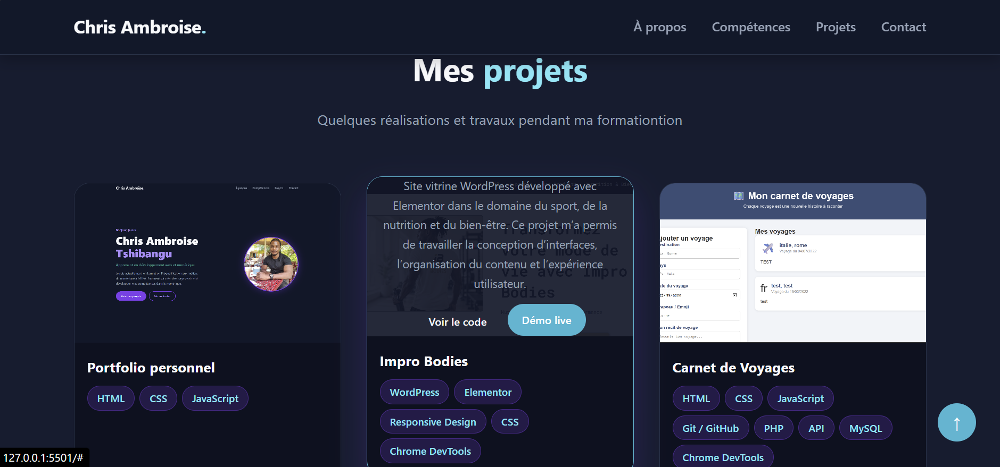
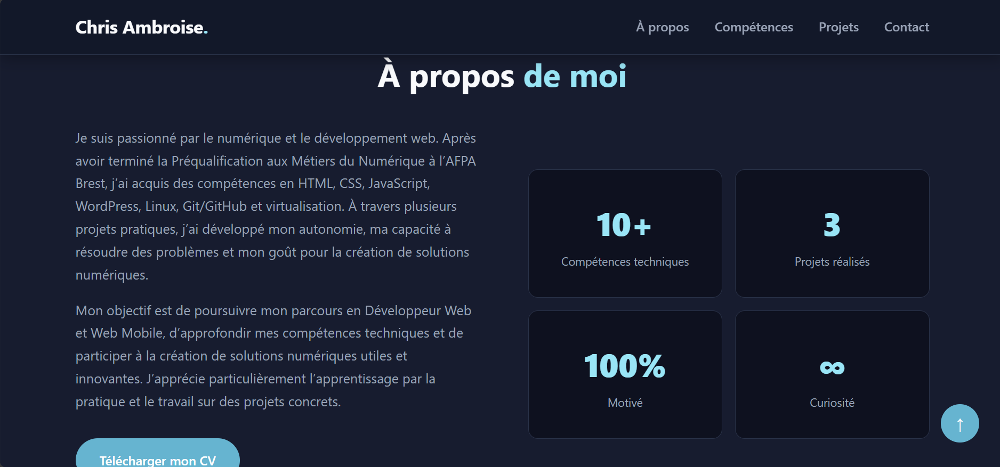

# Portfolio Personnel

## Présentation

Portfolio personnel réalisé dans le cadre de ma formation numérique à l’AFPA Brest.

Ce site présente mon parcours, mes compétences techniques et les différents projets réalisés durant ma formation.

---

## Démo en ligne

🌐 https://chris-ambroise.github.io/mon-portfolio/

---

## Technologies utilisées

- HTML5
- CSS3
- JavaScript
- Git & GitHub

---

## Fonctionnalités

- Présentation personnelle
- Section compétences
- Présentation des projets
- Contact
- Design responsive

---

## Aperçu

### Page d'accueil

---

### Section Projets

---

### À propos

---

## Auteur

Chris Ambroise Tshibangu

GitHub :
https://github.com/Chris-Ambroise

LinkedIn :
https://www.linkedin.com/in/chris-ambroise/

